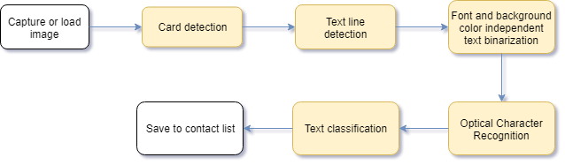
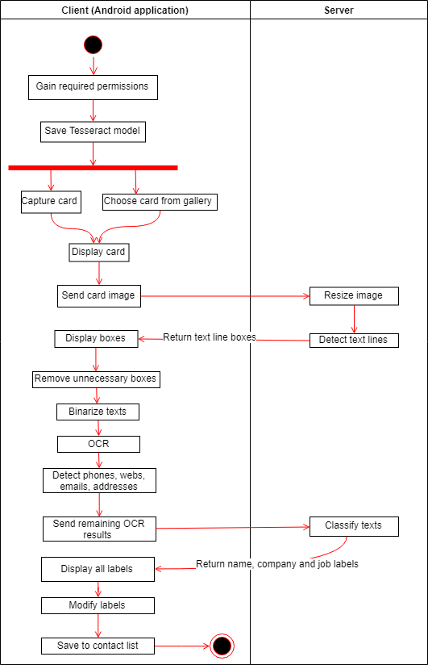

VGU THESIS - Business Card Detection based on Artificial Intelligence

# Overview
This repository contains an implementation of a system that can digitalize business cards and save the details into a contact list of the Android Operating System. The system has a client-server architecture where the client-side is the Android application and the server provides API using Flask.


## System flow


## Activity diagram


## Server setup
The server provides service for text-line detection and text-intent classification.

### Presiquitive
- Docker
- docker-compose 

### Install Docker
- [Docker for Windows](https://docs.docker.com/docker-for-windows/install/)
- [Docker for MacOS](https://docs.docker.com/docker-for-mac/install/)
- [Docker for Ubuntu](https://docs.docker.com/install/linux/docker-ce/ubuntu/)

Following installation step from previous links to install Docker on your system.

### Install Docker-Compose
On Windows and MacOS version of Docker desktop have included Docker-compose.  

### [Docker-compose for linux](https://docs.docker.com/compose/install/)
Run this command to download the current stable release of Docker Compose:

```
sudo curl -L "https://github.com/docker/compose/releases/download/1.24.1/docker-compose-$(uname -s)-$(uname -m)" -o /usr/local/bin/docker-compose
```
Apply executable permissions to the binary:
```
sudo chmod +x /usr/local/bin/docker-compose
```

### Run the server on your local system
After successfully installing Docker and running Docker Daemon, open command prompt and run the following command on the root directory to create an environment for server:
```
docker-compose up
```
Wait until Docker's containers finish creating the environment, go to [localhost:8080](http://localhost:8080)

### Online Server
https://thesis.tkhco.com.vn:8080

## Client setup
Android application handle business card image processing, text recognition and save contact details.

### Presiquitive
- JDK (8)
- OpenCV SDK(4.1.0)
- Android Studio (3.3.2)
- SDK (minSDK level 24)
- NDK (20.0.5594570)
- CMake

### Installing JDK
JDK 8 is necessary for Java development in Android Studio, the compiler can be installed from [Oracle's website](https://www.oracle.com/technetwork/java/javase/downloads/jdk8-downloads-2133151.html) after accepting their license agreement.

### OpenCV SDK
OpenCV SDK can be downloaded from [here](https://sourceforge.net/projects/opencvlibrary/).

### Installing Android Studio
Latest Android Studio for different platforms can be found [here](https://developer.android.com/studio/#downloads). 

### Installing SDK, NDK and CMake
Three of them can be installed by going to __Tools__->__SDK Manager__. In Android SDK select __SDK Tools__ tab. Then select suitable version for __Android SDK Build-Tools, Android SDK Platform-Tools, Android SDK Tools, NDK and CMake__.

### Setting path to Project and OpenCV SDK
Open [CMakeLists.txt](CMakeLists.txt) and change the first two paths which are paths of project and OpenCV SDK. For the Project path will be __specific_location/CardScanner/app__ and for OpenCV path will be __specific_location/opencv-4.1.0-android-sdk/OpenCV-android-sdk/sdk/native/jni/include__.

### Generating APK
1. Go to __Build__ -> __Select Build Variant__ and then select build variant you want to build for the app module.
2. Go to __Build__ -> __Generate Signed Bundle or APK__, select __APK__ option and then press __NEXT__ button. 
3. Next, you have to create a new key store or you can choose exisiting key in the [repo](key.jks), which has both passwords is _123456789_, and key alias is _key0_.
4. Then, choosing destination folder for the APK and select __release__ build variant. Finally, select both __V1 (Jar Signature)__ and __V2(Full APK Signature)__, and press the __FINISH__ button.
5. By default destination, the APK will be placed [here](release/app-release.apk).

